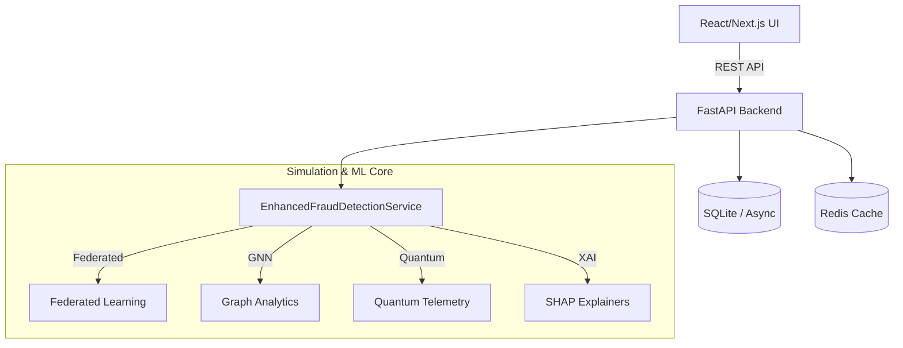

# Advanced AI Fraud Detection & Telemetry Platform

A production-ready, full-stack application demonstrating advanced Machine Learning concepts, simulated high-throughput data streaming, and a state-of-the-art glassmorphic Web3-style dashboard.

## 🚀 Features

This project bridges the gap between complex ML backend architecture and premium frontend design. 

### 🧠 Advanced ML & AI Concepts
- **Hybrid Simulation Engine**: Supports both real ML inference (XGBoost, LightGBM, CatBoost) and high-performance continuous simulation for UI telemetry.
- **Federated Learning Tracking**: Tracks local model updates, global aggregation rounds, and model weight divergence (drift) across participating nodes.
- **Graph Neural Networks (GNNs)**: Visualizes anomalous subgraph detection, node Eigenvector Centrality, and edge interaction heatmaps.
- **Quantum Computing Concepts**: Real-time display of simulated 64-qubit entanglement matrices and cryogenic hardware telemetry (Gate Fidelity, T1 Relaxation).
- **Explainable AI (XAI)**: Global feature importance powered by simulated SHAP (SHapley Additive exPlanations) values to interpret model decisions.

### 💻 System Design
The application is split into two robust, decoupled layers:

1.  **Backend (FastAPI, Python, Async)**
    - High-performance asynchronous REST API handling dynamic telemetry.
    - Designed with background workers (`uvicorn`) and `aiosqlite` for non-blocking IO.
    - Exposes comprehensive namespaces: `/alerts`, `/quantum`, `/federated`, `/gnn`, `/streaming`, `/analytics`.

2.  **Frontend (Next.js, React, Tailwind CSS)**
    - A meticulously designed Web3/Glassmorphic dashboard.
    - 20+ independent React components fetching real-time data from the FastAPI backend using `useEffect` intervals.
    - Fully responsive, component-driven architecture.

## 🛠 Tech Stack

- **Frontend**: Next.js, React, Tailwind CSS, Lucide Icons.
- **Backend**: FastAPI, Pydantic (v2), Uvicorn, Python 3.11.
- **Machine Learning**: XGBoost, LightGBM, CatBoost, Scikit-Learn.
- **Data & Streaming Simulation**: Kafka concepts, Redis (caching), SQLite (async).

## 📂 Architecture Overview



## 🚀 Getting Started

### 1. Start the Backend (FastAPI)
```bash
# Create virtual environment and install dependencies
python -m venv venv
source venv/bin/activate
pip install -r requirements.txt

# Run the backend server
uvicorn app.main:app --host 0.0.0.0 --port 8000 --reload
```
*The backend runs at `http://localhost:8000`*

### 2. Start the Frontend (Next.js)
```bash
cd frontend
npm install
npm run dev
```
*The frontend runs at `http://localhost:3000`*

## 🌐 Deployment Strategy

This repository is structured for a split-deployment:
- **Frontend**: Deploy the `frontend/` directory directly to **Vercel** for instant edge hosting.
- **Backend**: Deploy the root directory to **Render**, **Railway**, or **Fly.io** as a Web Service running `uvicorn`. Connect environment variables (`NEXT_PUBLIC_API_URL`) in the frontend to point to the live backend URL.

## ⚙️ Usage

Once both servers are running, navigate to `http://localhost:3000`. 
- **Dashboard**: View high-level metrics.
- **Settings**: Use the **Engine Controls** to adjust the real-time simulation speed and risk thresholds globally.
- **Alerts**: Use the **Test Vector Injector** to manually push test transactions through the streaming pipeline.
