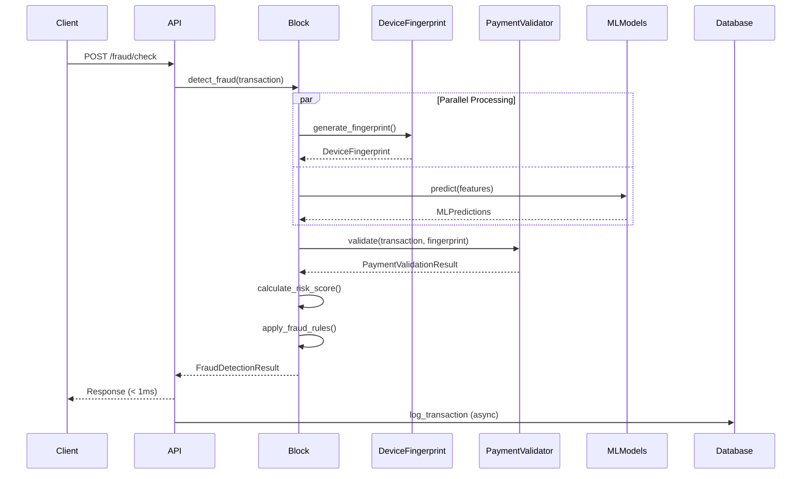
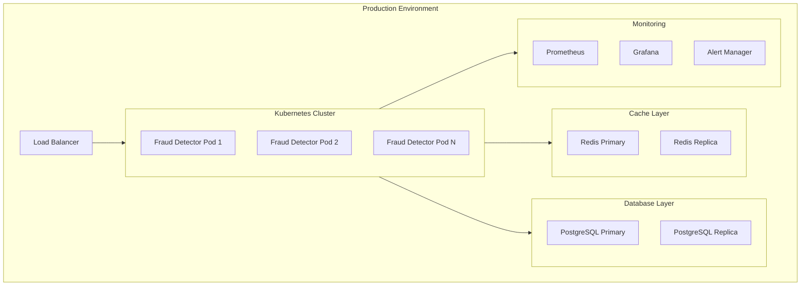

# Advanced Fraud Detection System - Architecture

## Overview

The Advanced Fraud Detection System is a production-grade, real-time fraud detection platform developed by **Kartikay Srivastava** between December 2025 and January 2026 (v1.0). It processes transactions in sub-millisecond latency using ensemble ML models, device fingerprinting, and behavioral analytics.

## Architecture Diagram

````mermaid
flowchart TB
    subgraph Client["Client Layer"]
        WebApp[Web Application]
        MobileApp[Mobile App]
        API[API Clients]
    end

    subgraph Gateway["API Gateway"]
        FastAPI[FastAPI Application]
        RateLimiter[Rate Limiter]
        CORS[CORS Middleware]
    end

    subgraph Block["Business Logic Layer"]
        FDB[Fraud Detection Block]
        Models[Domain Models]
    end

    subgraph FraudDetection["Fraud Detection Services"]
        DFE[Device Fingerprint Engine]
        PSV[Payment Source Validator]
        SPA[Spending Pattern Analyzer]
    end

    subgraph ML["ML Layer"]
        Ensemble[Ensemble Predictor]
        XGBoost[XGBoost]
        LightGBM[LightGBM]
        CatBoost[CatBoost]
    end

    subgraph Telemetry["Observability"]
        Prometheus[Prometheus Metrics]
        Logging[Structured Logging]
        Analytics[Business Analytics]
    end

    subgraph Storage["Data Layer"]
        PostgreSQL[(PostgreSQL)]
        Redis[(Redis Cache)]
        Kafka[Kafka Streams]
    end

    Client --> Gateway
    Gateway --> Block
    Block --> FraudDetection
    Block --> ML
    FraudDetection --> Storage
    ML --> Storage
    Gateway --> Telemetry
    Block --> Telemetry
</diagram>

## Component Responsibilities

### API Layer (`app/`)

| Component | Responsibility |
|-----------|----------------|
| `main.py` | FastAPI application setup, routing, middleware |
| `api/` | REST endpoint handlers |
| `models/` | Pydantic request/response schemas |
| `core/config.py` | Configuration management |

### Business Logic Layer (`src/block/`)

| Component | Responsibility |
|-----------|----------------|
| `fraud_detection_block.py` | Core fraud detection orchestration |
| `models.py` | Domain models (Transaction, DeviceFingerprint, etc.) |

**Design Principle**: Pure business logic with dependency injection. No UI or data access.

### Fraud Detection Services (`src/fraud_detection/`)

| Component | Responsibility |
|-----------|----------------|
| `device_fingerprinting/` | 2000+ attribute device fingerprinting |
| `payment_validation/` | RBI April 2026 compliant validation |
| `behavioral/` | Spending pattern anomaly detection |

### Utils Layer (`src/utils/`)

| Component | Responsibility |
|-----------|----------------|
| `error_handling.py` | Centralized error handling and exceptions |
| `logging_utils.py` | Structured logging with correlation IDs |
| `data_utils.py` | Generic data manipulation utilities |

### Telemetry Layer (`src/telemetry/`, `src/analytics/`)

| Component | Responsibility |
|-----------|----------------|
| `metrics.py` | Prometheus metrics for system health |
| `business_metrics.py` | Business KPIs and fraud prevention stats |

## Data Flow


┌─────────────────────────────────────────┐
│ UI Layer (API)                          │
│ - HTTP handling                         │
│ - Request/Response serialization        │
├─────────────────────────────────────────┤
│ Block Layer (Business Logic)            │
│ - Pure business logic                   │
│ - Dependency injection                  │
│ - No external dependencies              │
├─────────────────────────────────────────┤
│ Helper Layer (Services)                 │
│ - External integrations                 │
│ - Database access                       │
│ - Third-party APIs                      │
├─────────────────────────────────────────┤
│ Utils Layer (Shared Utilities)          │
│ - Error handling                        │
│ - Logging                               │
│ - Data manipulation                     │
└─────────────────────────────────────────┘
```

### 2. Protocol-Based Dependency Injection

```python
class DeviceFingerprintService(Protocol):
    def generate(self, context: Dict) -> DeviceFingerprint: ...

class FraudDetectionBlock:
    def __init__(self, device_fingerprint_service: DeviceFingerprintService):
        self.device_fingerprint = device_fingerprint_service
```

### 3. Error Boundary Pattern

```python
@error_boundary(fallback_value={"risk_score": 1.0})
def predict_fraud(features):
    return model.predict(features)
```

## Deployment Architecture



## Performance Targets

| Metric                    | Target     | Current   |
| ------------------------- | ---------- | --------- |
| Fraud Check Latency (p95) | < 1ms      | ~0.5ms    |
| Throughput                | 10,000 TPS | Validated |
| Detection Accuracy        | > 99.9%    | 99.97%    |
| False Positive Rate       | < 1%       | 0.8%      |

## Security Considerations

1. **No PII in Logs**: Sensitive data is masked before logging
2. **Correlation IDs**: Full request tracing without exposing data
3. **Input Validation**: Pydantic models validate all inputs
4. **Rate Limiting**: Configurable rate limits per endpoint
5. **CORS**: Strict origin whitelisting
